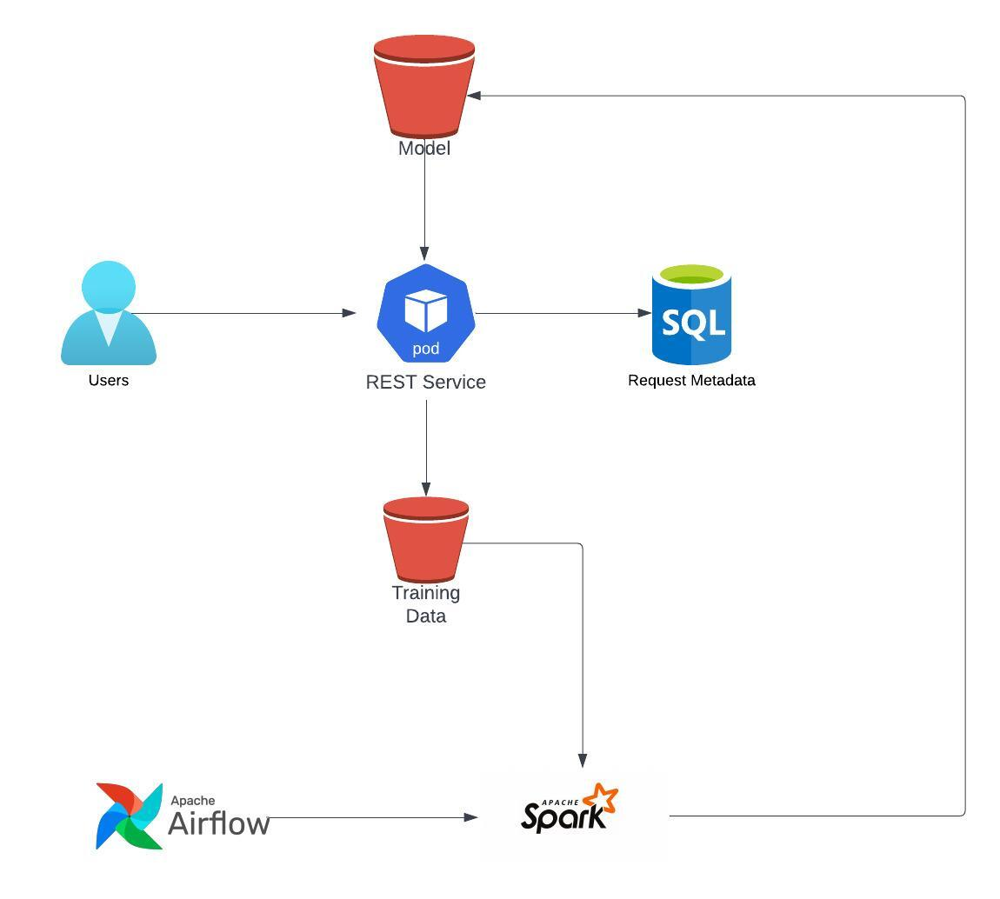

# fulhaus-aptitude-test

### Deployment and Testing Instructions

1. Please cone the repository 
2. Change the directory to the root of this repository
3. Use the docker-compose.yaml file to build and run the docker image
<br /><br />
  ```docker compose build```
<br /><br />
  ```docker compose up```

4. Once the Flask app is running, make a POST request with the image file

```
curl --location '{{local_docker_host}}/get_results' \
--form 'file=@"{{image_file}}"'
```
### Notes
* The model was trained outside the Flask app and loaded into the Docker container
* I could not get the CI/CD pipeline functioning, the goal was to build and push a new image to DockerHub for every commit to the master branch.
* The CI/CD pipeline could be setup to push an image to a container registry such as Azure AKS, and the image can be used with an orchestration tool such as Kubernetes to deploy the Flask as a Service.


### Suggested System Design

<p float = "left">
  
</p>

The user interacts with the REST service, by uploading the image.

The REST service logs the request in a metadata table to maintian the requests made to the service, along with other statistics from the Model.

The image uploaded by the user can be added to the training set, an additional step is required to annotate the data with a label.

The model training can be scheduled using Apache Airflow, with Spark jobs training the model.


